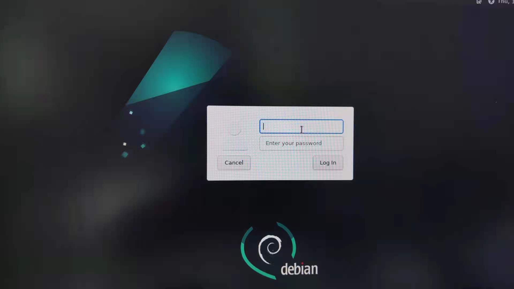
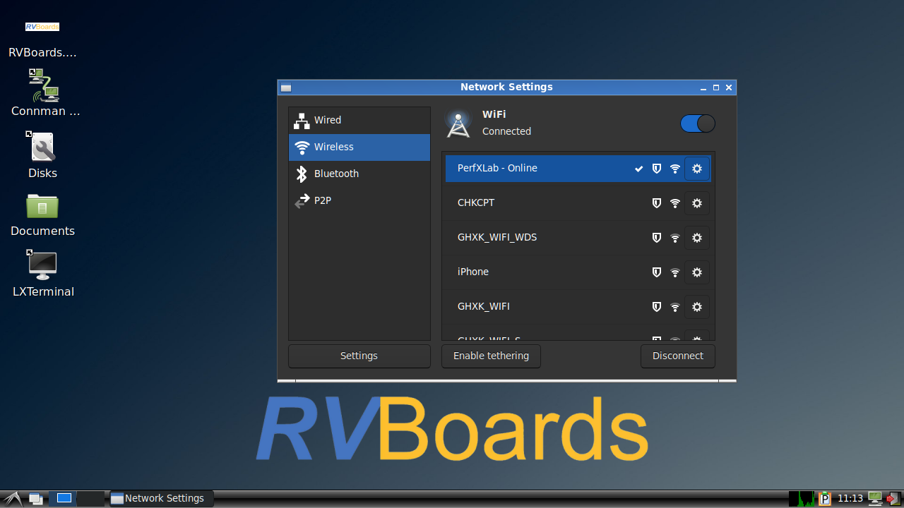
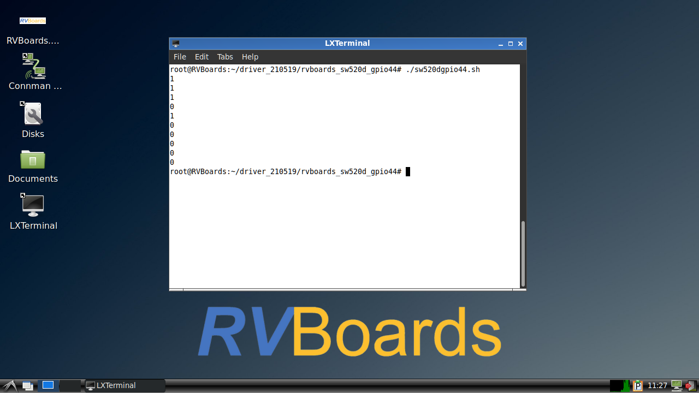

# RVBoards_D1_哪吒

## 系统环境介绍

目前移植的系统版本是Debian11，预装了LXDE桌面环境。

## 上手说明


1、于HDMI接口接入线缆至显示器;

2、于USB HOST 接口上连接鼠标和键盘；

3、于POWER接口上连接供电线；

4、通电1分钟左右系统启动完成进入登录界面，在此过程中，LED灯会亮蓝灯，5秒后熄灭。

5、系统账户和密码：

账号：root

密码：rvboards



6、终端

双击桌面第五个图标LXTerminal；


6、wifi配置

双击桌面第二个图标connman setting；



## 传感器Demo

### 倾斜模块sw-520d

模块代码地址：[rvboards/d1_demo: The demo projects for Allwinner D1 SBC (github.com)](https://github.com/rvboards/d1_demo)

代码运行方法（需要sudo权限）：

```
sudo ./sw520dgpio44.sh
```

需要使用杜邦线连接模块；

连接实物图如下图所示，具体请查看原理图；




### 循迹避障模块TCRT5000

模块代码地址：[rvboards/d1_demo: The demo projects for Allwinner D1 SBC (github.com)](https://github.com/rvboards/d1_demo)

代码运行方法（需要sudo权限）：

```
sudo ./tcrt5000gpio44.sh
```

需要使用杜邦线连接模块，具体请查看原理图；


### 光照强度传感器BH1750FVI----i2c

模块代码地址：[rvboards/d1_demo: The demo projects for Allwinner D1 SBC (github.com)](https://github.com/rvboards/d1_demo)

代码运行方法（需要sudo权限）：

```
make 
./runtest.sh
```

光照强度传感器模块连接图如下，具体请查看原理图。


### 大气压强传感器BMP280

模块代码地址：[rvboards/d1_demo: The demo projects for Allwinner D1 SBC (github.com)](https://github.com/rvboards/d1_demo)

```
make
./runtest.sh
```

大气压强传感器BMP280模块连接图如下，具体请查看原理图；


## 镜像烧录

### 基本介绍

RVBoards提供的镜像包含4个文件，开发者可以根据自己的需求下载相应的文件；

Windows环境下：

RVBoards_D1_Debian_lxde_img_win_v0.3.img，镜像里安装了LXDE桌面环境；烧录成功后通电进入登录界面；

RVBoards_D1_Debian_consose_img_win_v0.3.img，该镜像没有安装GUI，需要使用串口进入系统；

Linux环境下：

RVBoards_D1_Debian_lxde_img_linux_v0.3.gz，镜像里安装了LXDE桌面环境；烧录成功后通电进入登录界面；;

RVBoards_D1_Debian_consose_img_linux_v0.3.gz，该镜像没有安装GUI，需要使用串口进入系统；;

烧录方式支持两种；

### 方式一：Windows10

### 需要的文件

RVBoards_D1_Debian_lxde_img_win_v0.3.img或者RVBoards_D1_Debian_consose_img_win_v0.3.img

### 需要的系统环境

Windows10

### 需要的工具

软件部分：PhoenixCard
硬件部分：SD卡，推荐使用32GB

### PhoenixCard软件安装（需要环境windows）

点击PhoenixCard.exe进行制卡软件安装；

### 烧录镜像


### 方式二：Linux

### 需要的文件

RVBoards_D1_Debian_lxde_img_linux_v0.3.gz或者RVBoards_D1_Debian_consose_img_linux_v0.3.gz。

### 需要的系统环境

Linux（uuntu或者Debian）;

### 需要的工具

dd

### 烧录方法

```
sudo gzip -dc RVBoards_D1_Debian_lxde_img_linux_v0.3.gz | sudo dd of=/dev/sdc
or
sudo gzip -dc RVBoards_D1_Debian_consose_img_linux_v0.3.gz | sudo dd of=/dev/sdc
```

## 技术支持

QQ群：906962594


RVBoards论坛：[Perf-ABC（RISC-V SoC Board) | RVBoards 论坛](https://www.rvboards.org/forum/cn/category/7/perf-abc-risc-v-soc-board)


